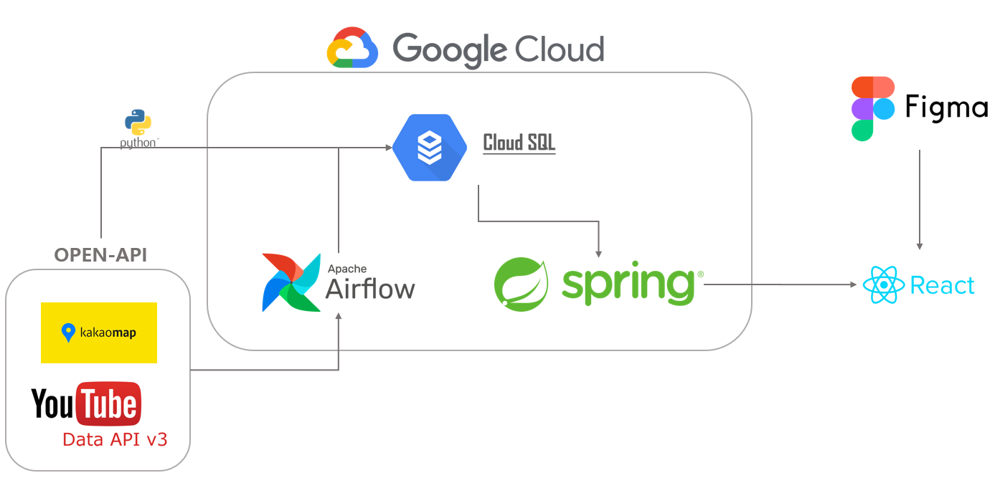

<p align="center">
  
</p>

<h1 align="center">유튜브 정보 기반 맛집 지도 서비스</h1>
<p align="center"><a href="https://hits.seeyoufarm.com"></a></p>

<br>

> <p style="color:gray; font-weight:bold;"></p>
> <p style="color:gray; font-weight:bold;">개발기간: 2023.09.04 ~ 2023.12.12</p>

<br>

## 💻 배포 주소

> <p style="color:gray; font-weight:bold;">{주소를 넣어주세요}<p>
> <p style="color:gray; font-weight:bold;">시현 영상: {영상 주소를 넣어주세요}</p>

<br>

## 🙋🏻‍♀️ 팀원 소개
<table>
    <tr>
        <td align="center">홍지섭</td>
        <td align="center">손재호</td>
        <td align="center">안치원</td>
        <td align="center">서화진</td>
        <td align="center">김성림</td>
    </tr>
    <tr>
        <td align="center"><a href="https://github.com/jiseop121">@jiseop121</a></td>
        <td align="center"><a href={주소넣어주세요}>@자신의아이디</a></td>
        <td align="center"><a href={주소넣어주세요}>@자신의아이디</a></td>
    </tr>
    <tr>
        <td>&middot; 팀장<br>&middot; 아이디어 제안자<br>&middot; 데이터베이스 구축 담당<br>&middot; 기획 담당</td>
        <td>&middot; 프론트엔드 개발 담당</td>
        <td>&middot; 서버 개발 담당</td>
        <td>&middot; 웹 디자인 설계 담당</td>
        <td>&middot; 웹 디자인 설계 담당</td>
    </tr>
</table>

<br>

## 💡 프로젝트 소개
- 유튜브 데이터 기반으로 맛집을 소개하는 유튜버를 선정한 뒤 유튜버들이 소개한 맛집들의 정보를 모아 지도 형식으로 제공하는 서비스입니다.
- 사용자들은 비디오 조회 수, 지역, 음식 카테고리와 같은 다양한 기준으로 맛집을 태그 형식으로 검색할 수 있어, 원하는 식당을 쉽게 찾을 수 있습니다.
- 사용자들은 방문한 맛집을 리스트에 추가하고, 친구들과 이를 공유할 수 있습니다. 또한, 맛집을 요청하거나 다른 사용자의 추천에 응답할 수 있는 시스템을 구축하여 사용자와 사용자간, 사용자와 개발자간의 소통을 도모합니다.
- 데이터베이스 코드를 오픈소스로 제공하여, 다른 개발자들이 손쉽게 유튜브 정보 기반의 지도 서비스를 개발할 수 있도록 기여했습니다.

<br>

## 📚 시작 가이드
### Requirements
For building and running the application you need:
- Front-end
  - {서비스 최소 조건을 기입해주세요}
- Back-end
  - {서비스 최소 조건을 기입해주세요}
  - Node.js 18.6.0
  - Npm 9.5.1
- database
  - {서비스 최소 조건을 기입해주세요}

### Installation

#### WEB
```
{방법을 기입해주세요}
$ npm install dotenv
$ npm install cryptojs
$ npm install express
$ npm install crypto
$ npm install --save @sentry/node
$ npm install axios
```
#### DATABASE
1. create .env file
    ```
    YOUTUBE_API_KEY = {input your key}
    YOUTUBE_API_KEY_2 =  {input your key}
    KAKAO_RESTAPI_KEY =  {input your key}
    SERVICE_ACCOUNT_JSON_PATH =  {input your json file path}
    SQL_CONNECT_NAME = {input your cloud sql name}
   ```
2. open cli
    ```
    cd ~/database
    pip install -r requirements.txt
    python main.py
    ```

<hr style="border:0; height:2px; background:gray;">

## 🐸 Stacks

### Enviornment
 
 


### Config
{추가 수정 부탁}


### Development


### Communication


<hr style="border:0; height:2px; background:gray;">

## 📖 주요 기능
### 메인페이지
- {추가예정입니다}
### 리스트페이지
- {추가예정입니다}
### 요청페이지
- {추가예정입니다}
### 건의사항페이지
- {추가예정입니다}

<br>

## 🖥️ 주요 화면
<table>
    <tr>
        <td align="center">메인페이지</td>
        <td align="center">리스트페이지</td>
    </tr>
    <tr>
        <td align="center"><span></span></td>
        <td align="center"><span></span></td>
    </tr>
    <tr>
        <td align="center">요청페이지</td>
        <td align="center">건의사항페이지</td>
    </tr>
    <tr>
        <td align="center"><span></span></td>
        <td align="center"><span></span></td>
    </tr>
</table>

<br>

## 🛠️ 시스템 아키텍처
